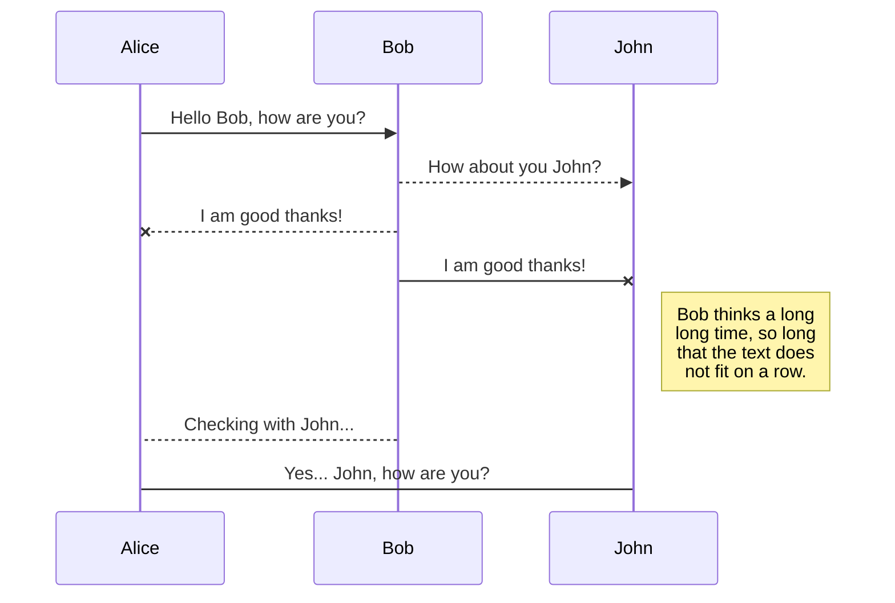
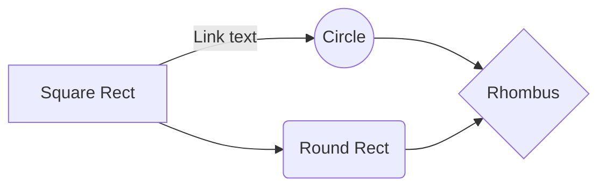

**歡迎閱讀我的使用文件**
**CIC101-99**

| lkhjkkjhkjh | sfsfsdfsdf |
|--|--|
| dsfsdf |sdfsdfdsdfsdf  |

> **ProTip:** You can disable any **Markdown extension** in the **File properties** dialog.

## 看看表格

SmartyPants converts ASCII punctuation characters into "smart" typographic punctuation HTML entities. For example:

|                |ASCII                          |HTML                         |
|----------------|-------------------------------|-----------------------------|
|Single backticks|`'Isn't this fun?'`            |'Isn't this fun?'            |
|Quotes          |`"Isn't this fun?"`            |"Isn't this fun?"            |
|Dashes          |`-- is en-dash, --- is em-dash`|-- is en-dash, --- is em-dash|

SDL;GJKDFGKDFGKIJHJKHDHGKJDHGHJKDHGJKSDFHGHSDGJKDFHGJKDHJK

## UML 圖表

You can render UML diagrams using [Mermaid](https://mermaidjs.github.io/). For example, this will produce a sequence diagram:

And this will produce a flow chart:

